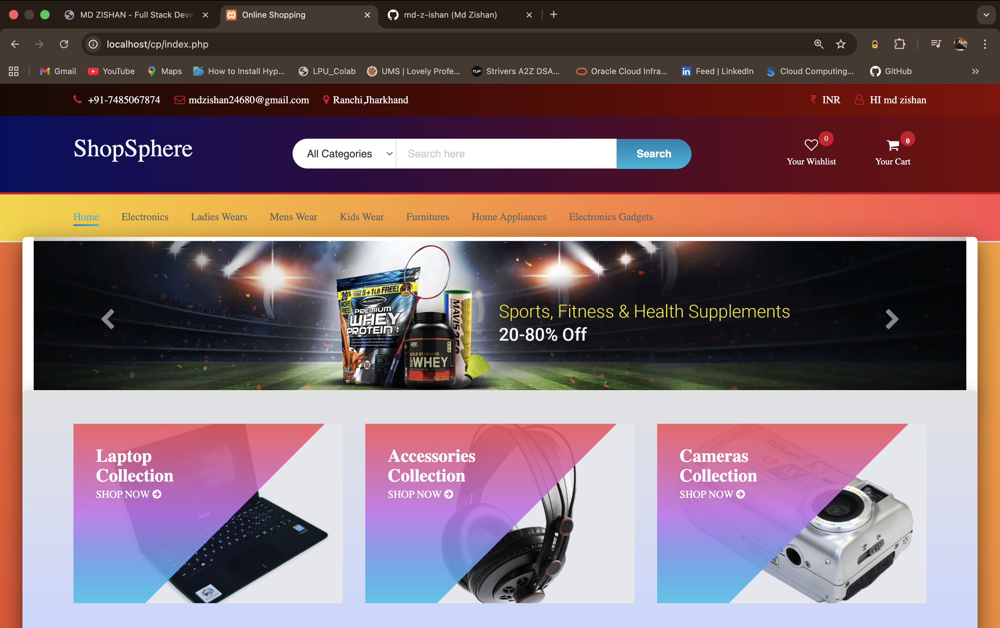

# SHOPSPHERE -Online Shopping System - E-Commerce Platform

A complete, full-featured e-commerce website built with PHP and MySQL. This project includes both customer-facing shopping functionality and a comprehensive admin panel for managing products, users, orders, and suppliers.

---

## 📋 Features

### Customer Features

- **User Authentication**: Secure registration and login system
- **Product Browsing**: Browse and search through product catalog
- **Shopping Cart**: Add products to cart and manage quantities
- **Wishlist**: Save favorite products for later
- **Product Reviews**: Read and write reviews for products
- **Checkout Process**: Secure checkout with order summary
- **Payment Processing**: Integrated payment gateway support
- **Order History**: View all previous orders
- **Order Tracking**: Track order status and details
- **Newsletter Subscription**: Subscribe to promotional offers and updates

### Admin Features

- **Product Management**: Add, edit, and delete products with images
- **User Management**: Create, update, and manage customer accounts
- **Order Management**: View and manage all customer orders
- **Supplier Management**: Add and manage product suppliers
- **Sales Analytics**: View daily sales reports and statistics
- **Activity Tracking**: Monitor user activity on the platform
- **User Roles**: Manage different user permission levels

---

## 🛠️ Technology Stack

- **Backend**: PHP 7.x
- **Database**: MySQL
- **Frontend**: HTML5, CSS3, Bootstrap
- **JavaScript**: jQuery, Vanilla JavaScript
- **Server**: Apache (XAMPP/WAMP)
- **Additional Tools**:
  - jQuery UI for enhanced user interface
  - Slick Carousel for image sliders
  - SweetAlert for notifications
  - Font Awesome for icons

---

## 📦 Project Structure

```
/cp (root)
├── index.php                 # Home page
├── register.php              # User registration
├── login.php                 # User login
├── product.php               # Single product view
├── products.php              # Product listing
├── cart.php                  # Shopping cart
├── wishlist.php              # Wishlist management
├── checkout.php              # Checkout page
├── checkout_process.php      # Payment processing
├── payment_success.php       # Payment confirmation
├── order_successful.php      # Order confirmation
├── myorders.php              # Order history
├── review.php                # Product reviews
├── config.php                # Configuration & DB connection
├── db.php                    # Database queries
├── header.php                # Header component
├── footer.php                # Footer component
├── body.php                  # Home page body
│
├── /admin                    # Admin panel root
│   ├── login.php             # Admin login page
│   ├── reg.php               # Admin registration
│   ├── /admin                # Admin dashboard
│   │   ├── index.php         # Admin dashboard
│   │   ├── add_products.php  # Add new products
│   │   ├── edit_product.php  # Edit existing products
│   │   ├── products_list.php # View all products
│   │   ├── manageuser.php    # User management
│   │   ├── edituser.php      # Edit user details
│   │   ├── orders.php        # Order management
│   │   ├── addsuppliers.php  # Supplier management
│   │   ├── activity.php      # Activity logs
│   │   ├── salesofday.php    # Daily sales report
│   │   ├── profile.php       # Admin profile
│   │   ├── sidenav.php       # Sidebar navigation
│   │   ├── topheader.php     # Admin header
│   │   ├── footer.php        # Admin footer
│   │   ├── mapping.php       # Product mapping
│   │   └── /assets           # Admin assets
│   │       ├── /css          # Stylesheets
│   │       ├── /js           # JavaScript files
│   │       ├── /img          # Images
│   │       └── /vendor       # Third-party libraries
│   └── /assets               # Admin login assets
│       ├── /css              # Stylesheets
│       ├── /js               # JavaScript files
│       └── /fonts            # Font files
│
├── /css                      # Frontend stylesheets
├── /js                       # Frontend scripts
├── /img                      # Images and graphics
├── /fonts                    # Font files
├── /product_images           # Product images (uploaded)
├── /database                 # Database files
│   └── onlineshop.sql        # Database schema & data
└── README.md                 # This file
```

---

## 💾 Database Setup

The project uses a MySQL database named `onlineshop`. The database includes tables for:

- Users (Customers & Admin)
- Products
- Orders
- Order Items
- Cart
- Wishlist
- Reviews
- Suppliers
- Activity Logs

### Database File

Located at: `/database/onlineshop.sql`

---

## 🚀 Installation & Setup

### Prerequisites

- XAMPP, WAMP, or MAMP installed
- Apache and MySQL services running
- PHP 7.x or higher

### Step-by-Step Installation

1. **Start XAMPP/WAMP/MAMP**
   - Open XAMPP Control Panel (or WAMP/MAMP equivalent)
   - Start Apache and MySQL services

2. **Clone/Download Project**

   ```bash
   # For XAMPP (Windows)
   cd C:\xampp\htdocs\
   git clone https://github.com/yourusername/online-shopping-system.git cp

   # For XAMPP (Mac/Linux)
   cd /Applications/XAMPP/xamppfiles/htdocs/
   git clone https://github.com/yourusername/online-shopping-system.git cp
   ```

   Or extract files directly to your web server directory

3. **Import Database**

   **Option A: Automatic Setup (Recommended)**

   ```bash
   cd database

   # For Mac/Linux
   ./setup.sh

   # For Windows
   setup.bat
   ```

   **Option B: Manual Import via phpMyAdmin**
   - Open phpMyAdmin: `http://localhost/phpmyadmin`
   - Click "Import" tab
   - Browse and select `database/onlineshop.sql`
   - Click "Go" to import
   - The database will be automatically created

   **Option C: Command Line**

   ```bash
   # Navigate to database folder
   cd database

   # Import the SQL file
   mysql -u root < onlineshop.sql
   ```

4. **Configure Database Connection (if needed)**

   If your MySQL has a password, update these files:
   - `db.php` - Update database credentials
   - `config.php` - Update database constants
   - `admin/includes/db.php` - Update admin database config

5. **Access the Application**
   - Open browser and navigate to: `http://localhost/cp/`
   - You should see the home page

---

## 👤 User Login Credentials

### Customer Access

Test user accounts (Password for all: `password`):

- testuser@gmail.com
- demouser@gmail.com
- otheruser@gmail.com

Or register a new account: `http://localhost/cp/register.php`

### Admin Access

- Navigate to: `http://localhost/cp/admin/login.php`
- **Email**: `admin@gmail.com`
- **Password**: `admin123`

---

## 🎯 Main Functionalities

### For Customers

1. **Create Account** - Register with email and password
2. **Browse Products** - View product catalog with filtering
3. **Product Details** - See detailed info, images, and reviews
4. **Add to Cart** - Select products and quantities
5. **Wishlist** - Save items for future purchase
6. **Checkout** - Review items and proceed to payment
7. **Payment** - Complete transaction with order confirmation
8. **Track Orders** - View order history and status
9. **Leave Reviews** - Rate and review purchased products
10. **Newsletter** - Subscribe to promotional emails

### For Administrators

1. **Dashboard** - View sales overview and statistics
2. **Product Management**
   - Add new products with images
   - Edit product details
   - Delete products
   - Manage product categories
3. **User Management**
   - View all registered users
   - Edit user profiles
   - Manage user roles
4. **Order Management**
   - View all customer orders
   - Update order status
   - Process refunds
5. **Supplier Management**
   - Add new suppliers
   - Manage supplier information
   - Track inventory
6. **Reports**
   - Daily sales reports
   - Activity logs
   - User activity tracking

---

## 📝 Key Files Description

| File              | Purpose                                       |
| ----------------- | --------------------------------------------- |
| `config.php`      | Database connection and session configuration |
| `db.php`          | Database query functions                      |
| `header.php`      | Common header component                       |
| `footer.php`      | Common footer component                       |
| `action.php`      | Ajax actions handler                          |
| `homeaction.php`  | Home page specific actions                    |
| `check_users.php` | User validation functions                     |

---

## 🔒 Security Features

- **Password Hashing**: Secure password storage
- **SQL Injection Prevention**: Using prepared statements
- **Session Management**: Secure user sessions
- **Input Validation**: Client and server-side validation
- **XSS Protection**: Output escaping

---

## 📱 Responsive Design

The project is built with Bootstrap framework ensuring:

- Mobile-friendly interface
- Responsive layout on all devices
- Touch-friendly buttons and forms
- Optimized images for different screen sizes

---

## 🎨 UI/UX Components

- **Slick Carousel** - Product image sliders
- **Material Dashboard** - Admin panel styling
- **Font Awesome Icons** - Icon library
- **Bootstrap Components** - Modals, forms, tables
- **SweetAlert** - Beautiful alerts and confirmations

---

## 🐛 Known Issues & Future Improvements

Potential enhancements:

- Advanced search and filtering
- Product recommendations
- Email notifications
- SMS order updates
- Multiple payment gateway integration
- Inventory management system
- Customer support chat
- Advanced analytics dashboard

---

## 📄 License

This project is licensed under the MIT License - see the LICENSE file for details.

---

## 👨‍💻 Author

Project developed and maintained by Md Zishan

For support and inquiries: mdzishan24680@gmail.com

---

## ⭐ Support

If you find this project helpful, please:

- Give it a star ⭐
- Share with others
- Report issues
- Contribute improvements

## 📸 Screenshots

### 🏠 Homepage


---

## 🤝 Contributing

Contributions are welcome! To contribute:

1. Fork the repository
2. Create a feature branch (`git checkout -b feature/AmazingFeature`)
3. Commit your changes (`git commit -m 'Add some AmazingFeature'`)
4. Push to the branch (`git push origin feature/AmazingFeature`)
5. Open a Pull Request

---
